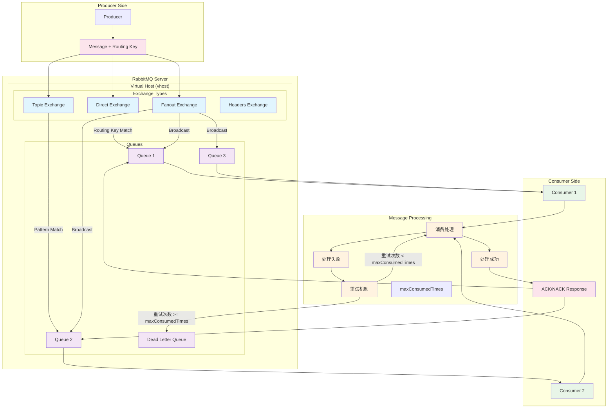

# 阿里云RabbitMQ 概念关系图

以下Mermaid图展示了阿里云RabbitMQ中各个核心概念的联系关系：

## 核心概念说明

### 1. Virtual Host (vhost)
- 虚拟主机，提供逻辑隔离
- 不同应用可使用不同vhost，互不干扰
- 默认vhost为 "/"

### 2. Exchange（交换机）
- 负责接收消息并根据路由规则分发到队列
- **Direct Exchange**: 精确匹配routing key
- **Topic Exchange**: 支持通配符匹配routing key
- **Fanout Exchange**: 广播到所有绑定的队列，忽略routing key
- **Headers Exchange**: 根据消息头属性路由

### 3. Routing Key（路由键）
- 生产者发送消息时指定的路由标识
- Exchange根据routing key和绑定规则决定消息去向
- Topic Exchange支持通配符：`*`匹配单个单词，`#`匹配零个或多个单词

### 4. Queue（队列）
- 存储待消费消息的容器
- 消费者从队列中获取消息
- 支持持久化、独占、自动删除等属性

### 5. ACK/NACK（消息确认）
- **ACK**: 消息处理成功确认，消息从队列中删除
- **NACK**: 消息处理失败确认，消息可重新投递或进入死信队列
- **autoAck**: 自动确认模式，消息一旦投递即确认

### 6. maxConsumedTimes（最大消费次数）
- 控制消息最大重试次数
- 超过限制后消息进入死信队列或被丢弃
- 避免因异常消息导致的无限重试

### 7. Dead Letter Queue（死信队列）
- 存储无法正常处理的消息
- 消息超过重试次数或被拒绝时进入
- 用于异常消息的后续处理和分析

## 消息流转过程

1. **生产阶段**: Producer发送消息到Exchange，携带Routing Key
2. **路由阶段**: Exchange根据绑定规则和Routing Key将消息路由到对应Queue
3. **消费阶段**: Consumer从Queue消费消息
4. **处理阶段**: Consumer处理消息，成功则发送ACK，失败则可能重试
5. **异常处理**: 重试次数超过maxConsumedTimes后，消息进入死信队列

## 在ThinkCommand项目中的应用

本项目通过`ThinkAliyunRabbitMQCommand`抽象类封装了阿里云RabbitMQ的消费逻辑：

- 支持动态配置Exchange、Queue、Routing Key
- 内置重试机制和死信队列处理
- 支持多Worker并发消费
- 提供QoS设置和确认模式选择
- 集成Swoole Process Pool实现高性能消费
- 支持阿里云特有的认证方式(AccessKey/Secret)
- 完全托管的云端RabbitMQ服务
